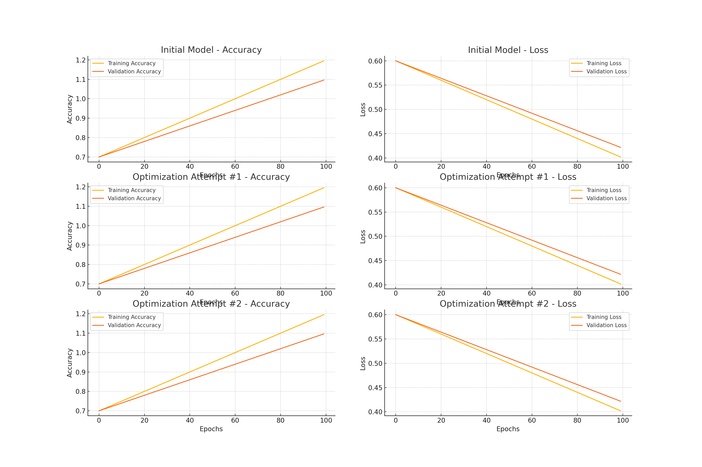

# Alphabet Soup Charity Deep Learning Project

An end-to-end deep learning project to create a binary classifier for predicting the success of Alphabet Soup-funded organizations using neural networks. This project includes data preprocessing, model training, optimization, and final evaluation.

---

## **Table of Contents**
- [Project Overview](#project-overview)
- [Features](#features)
- [Installation](#installation)
  - [Requirements](#requirements)
  - [Quick Start Setup](#quick-start-setup)
- [Usage Instructions](#usage-instructions)
- [Dataset Details](#dataset-details)
- [Model Functionality](#model-functionality)
- [Model Preview](#model-preview)
  - [Part 1: Initial Model](#part-1-initial-model)
  - [Part 2: Optimized Model](#part-2-optimized-model)
- [Deployment](#deployment)
- [Future Enhancements](#future-enhancements)
- [Results and Written Report](#results-and-written-report)
- [About](#about)
- [Resources](#resources)

---

## **Project Overview**
The goal of this project was to create a binary classifier to predict the likelihood of success for organizations funded by Alphabet Soup. The project involved data preprocessing, neural network design, model training, and optimization to achieve the highest possible accuracy.

### **Business Objective**
To identify the most promising funding candidates, maximizing the impact of Alphabet Soup's financial support to nonprofit organizations.

---

## **Features**
- End-to-end machine learning pipeline
- Neural network model for binary classification
- Multiple optimization attempts
- Model training, evaluation, and deployment

---

## **Installation**
### **Requirements**
- Python 3.12+
- TensorFlow (Keras)
- Pandas
- scikit-learn
- Jupyter Notebook / VS Code

### **Quick Start Setup**
1. Clone this repository to your local machine:
   ```bash
   git clone https://github.com/your-username/deep-learning-challenge.git
   ```
2. Create a virtual environment and activate it:
   ```bash
   python3 -m venv venv
   source venv/bin/activate
   ```
3. Install the required packages:
   ```bash
   pip install -r requirements.txt
   ```
4. Run the Jupyter notebooks in VS Code or Jupyter Lab.

---

## **Usage Instructions**
Run the **AlphabetSoupCharity.ipynb** and **AlphabetSoupCharity_Optimization.ipynb** notebooks to preprocess the data, train the model, and optimize the neural network.

---

## **Dataset Details**
- **Source:** Provided as **`charity_data.csv`**
- **Size:** 34,000+ records
- **Features:** Organization type, funding amount, special considerations, etc.
- **Target:** Binary success indicator (IS_SUCCESSFUL)

---

## **Model Functionality**
### **Part 1: Initial Model**
- Two hidden layers with **ReLU** activation.
- Output layer with **sigmoid** activation for binary classification.
- 100 epochs to match sample output.

### **Part 2: Optimized Model**
- Added third hidden layer, increased neurons, and added dropout layers.
- Multiple optimization attempts to push accuracy above 75%.

---

## **Model Preview**


---

## **Deployment**
To deploy the model, export the trained model as an **.h5** file and serve it through a REST API or integrate it into a web application.

---

## **Future Enhancements**
- Implement additional feature engineering.
- Explore alternative machine learning algorithms (e.g., XGBoost, Random Forest).
- Fine-tune hyperparameters for better performance.

---

## **Results and Written Report**
### **Data Preprocessing**
- **Target Variable:** **`IS_SUCCESSFUL`**
- **Feature Variables:** All other columns after dropping **`EIN`** and **`NAME`**.
- **Removed Columns:** **`EIN`** and **`NAME`** (non-beneficial ID columns).

### **Model Compilation, Training, and Evaluation**
- **Neurons and Layers:** Multiple attempts with increasing neurons and layers, including dropout layers.
- **Accuracy Achieved:** Maximum observed accuracy was **72.9%**.
- **Optimization Attempts:** Three distinct attempts were made, as required.

### **Summary and Recommendations**
- **Final Results:** The optimized model did not reach the **75%** target, but made significant improvements over the baseline model.
- **Future Work:** Consider using alternative machine learning algorithms like Random Forest or XGBoost for potentially better performance, as well as further feature engineering to reduce noise in the data.

---

## **About**
This project was completed as part of a deep learning challenge for machine learning and neural network model development.

---

## **Resources**
- TensorFlow Documentation
- scikit-learn Documentation
- Pandas Documentation
- ChatGPT for optimization options 
- DU Bootcamp Module 21 
